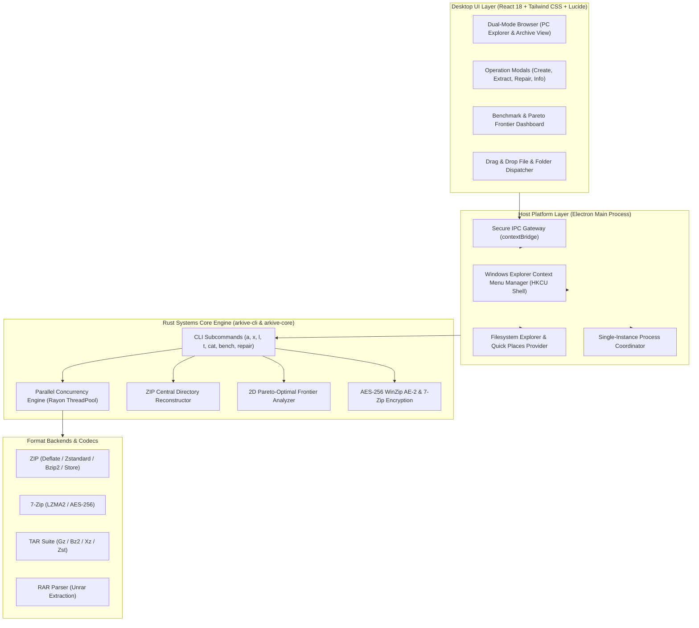
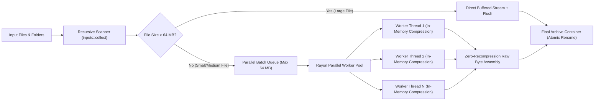
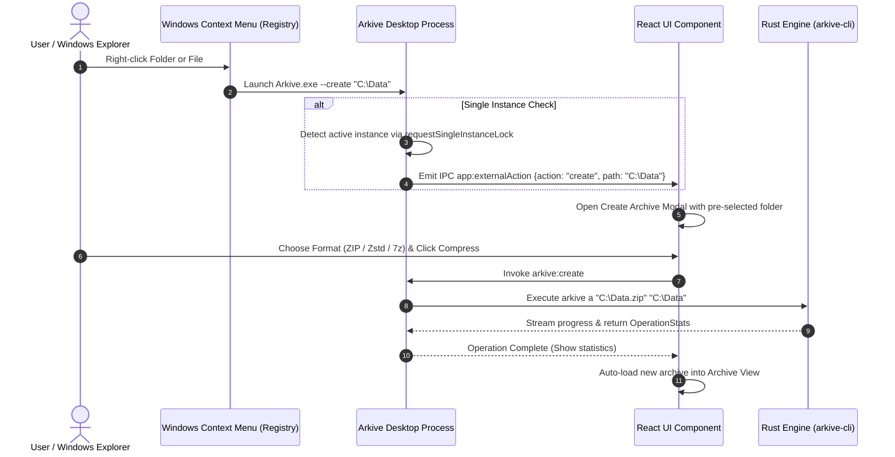
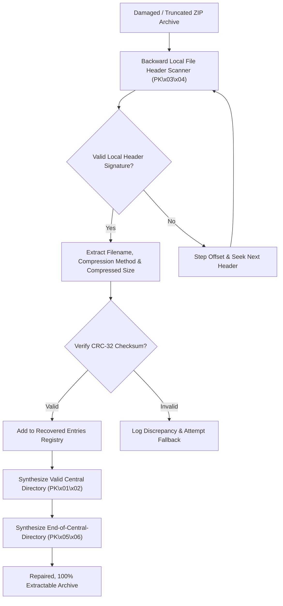
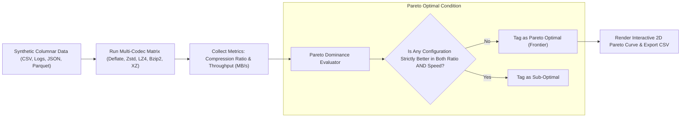
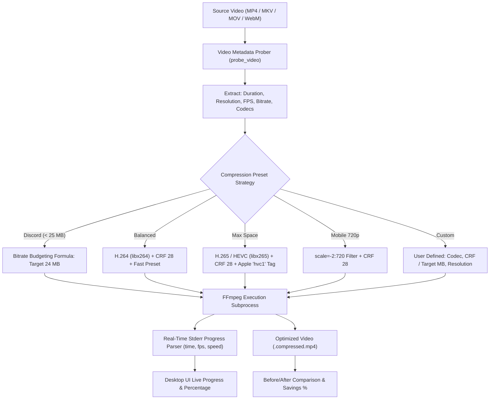

# Arkive Architecture & Engineering Guide 🗜️

This document details the architectural design, concurrency models, data structures, and algorithms powering **Arkive**. It is written for engineers, recruiters, and contributors seeking to understand how Arkive was conceived, structured, and implemented.

---

## 1. High-Level System Architecture

Arkive bridges a modern, high-performance **Rust systems core** with a responsive **Electron + React desktop application** and a scriptable **CLI**.



---

## 2. Concurrency & Concurrency Models

### Parallel In-Memory Rayon Chunking Architecture
Standard single-threaded ZIP compressors process files sequentially, creating major CPU bottlenecks on multi-core workstations. Arkive implements a **batch-oriented in-memory Rayon worker pool**:



1. **Traversal & Sanitization (`inputs::collect`):** Recursively walks directories, normalizes relative paths, sanitizes path traversal sequences (Zip-Slip protection), and collects file metadata.
2. **Batch Queueing:** Files smaller than `64 MB` are gathered into batches totaling up to `64 MB`.
3. **Parallel In-Memory Compression:** Each thread in the Rayon pool compresses an individual file into a standalone in-memory ZIP buffer.
4. **Zero-Copy Atomic Stitching:** The master thread consumes completed in-memory archives and performs raw-copy byte transfers (`raw_copy_file`) directly into the final container without re-compressing or decoding.
5. **Atomic Rename Guarantee:** Writes occur to `.arkive-tmp` files and atomically replace the destination path only on complete success.

---

## 3. Dual-Mode Desktop Interaction & Windows Shell Integration

Arkive mirrors WinRAR's signature dual-mode file management while integrating with the Windows Explorer shell.



---

## 4. ZIP Central Directory Recovery Engine

When network transfers, object storage uploads (e.g. S3 / GCS), or disk failures truncate a ZIP archive, the **Central Directory (`PK\x01\x02`)** and **End of Central Directory (`PK\x05\x06`)** records at the tail of the file are often severed. Standard tools report "Unexpected end of archive".

Arkive implements a byte-level reverse reconstruction engine:



---

## 5. Storage vs. Compute Pareto Frontier Analysis

In data engineering pipelines (Apache Iceberg, Parquet, Delta Lake, ClickHouse), picking the wrong compression codec results in either excessive cloud storage bills or CPU exhaustion during ETL queries. Arkive provides an algorithmic profiler to discover mathematically optimal configurations.



---

## 6. Video Compression & Transcoding Architecture

Standard DEFLATE/ZIP algorithms cannot effectively compress video files (MP4, MKV, MOV, WebM) because modern video containers already contain high-entropy, DCT/wavelet-compressed bitstreams. True video compression requires perceptual re-encoding and bitrate budgeting.

Arkive bundles an embedded **FFmpeg 6.1** transcoding engine integrated across the Rust core, CLI, and Electron desktop app:



### Bitrate Budgeting Formula
When compressing to strict platform upload caps (such as Discord's 25 MB limit or email attachments), Arkive dynamically solves for the maximum allowable video bitrate given the video's total duration:

$$\text{Bitrate}_{\text{video}} = \left( \frac{\text{TargetMB} \times 8192}{\text{Duration}_{\text{seconds}}} \right) - \text{Bitrate}_{\text{audio}}$$

- Guarantees video output stays strictly within the target threshold without guessing.
- Constrains buffer size (`-bufsize`) and maximum bitrate (`-maxrate`) to prevent bandwidth spikes.
- Downscales resolutions higher than 1080p to prevent compression artifacts at constrained bitrates.

---

## 7. Repository Directory Map

```
arkive/
├── crates/
│   ├── arkive-core/                # Pure systems compression library
│   │   ├── src/
│   │   │   ├── archive.rs          # Unified create / extract / list facades
│   │   │   ├── bench.rs            # Multi-codec benchmark engine & Pareto frontier
│   │   │   ├── codec.rs            # Raw stream encoders/decoders (Zstd, LZ4, etc.)
│   │   │   ├── format.rs           # Format discriminator & extension sniffer
│   │   │   ├── inputs.rs           # Recursive folder scanner & item collector
│   │   │   ├── progress.rs         # Streaming progress tracker & cancellation
│   │   │   ├── repair.rs           # Truncated ZIP central directory reconstructor
│   │   │   ├── util.rs             # Path normalization & Zip-Slip protection
│   │   │   ├── video.rs            # Video probing, transcoding & bitrate budgeting
│   │   │   └── formats/            # Specialized format drivers (ZIP, 7z, TAR, RAR)
│   └── arkive-cli/                 # Command-line interface binary
│       └── src/main.rs             # Clap CLI, formatted terminal tables, JSON output
├── apps/
│   └── desktop/                    # Desktop application
│       ├── build/installer.nsh     # Windows NSIS Shell Context Menu script
│       ├── electron/
│       │   ├── main.cjs            # Electron process, lifecycle, IPC routing
│       │   ├── preload.cjs         # Context bridge isolating renderer from Node
│       │   └── shell-integration.cjs # Windows Registry HKCU shell context menu
│       └── src/
│           ├── App.tsx             # Root React coordinator (Dual Mode state)
│           ├── components/
│           │   ├── FileBrowser.tsx # Dual-mode PC explorer & archive inspector
│           │   ├── Toolbar.tsx     # Command bar with context menu status
│           │   ├── VideoModal.tsx  # Video compressor, transcoder & preset selector
│           │   ├── CreateModal.tsx # Archive creation with folder & file selectors
│           │   ├── BenchmarkView.tsx # 2D Pareto frontier analytics dashboard
│           │   └── ...             # Modals for extract, repair, preview, info
└── Cargo.toml                      # Root Cargo workspace manifest
```
