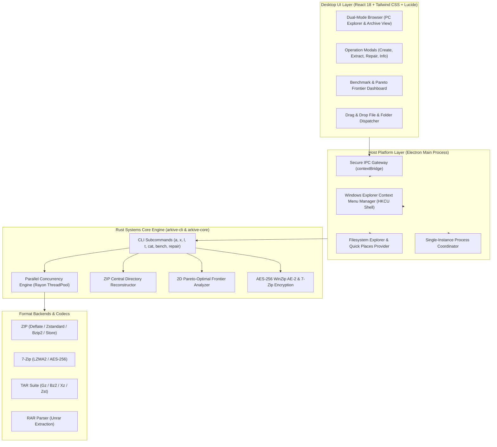

# Arkive 🗜️

[](https://opensource.org/licenses/MIT)
[](https://www.rust-lang.org/)
[](https://www.electronjs.org/)
[](https://react.dev/)
[](https://www.typescriptlang.org/)

**Arkive** is an open-source, high-performance archive manager, systems compression engine, and data engineering toolkit designed as a modern alternative to legacy tools like WinRAR and 7-Zip.

Built with a **Rust systems core**, a unified CLI, and a desktop UI powered by **Electron and React**, Arkive delivers multi-threaded compression, automated ZIP corruption repair, and a compression benchmark suite tailored for data engineers.

---

## Architecture Overview



> 📖 **Deep Dive:** Read the complete [ARCHITECTURE.md](ARCHITECTURE.md) for sequence diagrams, threadpool mechanics, and algorithmic details.

---

## Feature Matrix

| Capability | Arkive | WinRAR | 7-Zip | PeaZip |
|---|:---:|:---:|:---:|:---:|
| **Modern Desktop UI** | ✅ React + Tailwind | ❌ 1990s Win32 | ❌ 1990s Win32 | ⚠️ Qt/GTK |
| **Open Source & Free License** | ✅ MIT | ❌ Proprietary ($39) | ✅ LGPL | ✅ LGPL |
| **Windows Explorer Right-Click Integration** | ✅ Yes (Native Shell) | ✅ Yes | ✅ Yes | ⚠️ Partial |
| **PC File Explorer & Quick Places** | ✅ Yes | ✅ Yes | ❌ Basic tree | ⚠️ Partial |
| **Cross-Format Support** (ZIP, 7z, TAR.*, RAR extract) | ✅ Full | ✅ Full | ✅ Full | ✅ Full |
| **Parallel ZIP Compression** (Rayon memory chunking) | ✅ Native | ⚠️ Limited | ✅ Multi-threaded | ⚠️ Limited |
| **Modern Data Codecs** (Zstandard, LZ4) | ✅ Built-in | ❌ No | ❌ (requires plugin) | ⚠️ Partial |
| **Data Engineering Benchmark Suite** | ✅ Built-in | ❌ No | ⚠️ CPU only | ❌ No |
| **Pareto-Optimal Frontier Analysis** | ✅ Built-in | ❌ No | ❌ No | ❌ No |
| **Damaged ZIP Central Directory Repair** | ✅ Local Header Scan | ⚠️ Basic | ❌ No | ⚠️ Basic |
| **Folder Compression & Drag-and-Drop** | ✅ Yes | ✅ Yes | ✅ Yes | ✅ Yes |
| **AES-256 WinZip AE-2 / 7z Encryption** | ✅ Yes | ✅ Yes | ✅ Yes | ✅ Yes |
| **Unified CLI (`arkive`)** | ✅ Built-in | ⚠️ Command prompt | ✅ `7z` | ⚠️ Scriptable |

---

## Data Engineering Highlights

Arkive was engineered specifically with **modern data systems and analytics workloads** in mind:

1. **Storage vs. Compute Trade-Off Profiler:**
   When architecting columnar storage formats (Parquet, ORC) or table formats (Apache Iceberg, Delta Lake), choosing between **Zstandard**, **LZ4**, and **Deflate** has massive cost implications. Arkive’s benchmark engine automatically identifies **Pareto-optimal** codecs (maximum ratio for minimum compute latency).
2. **Parallel Archive Pipeline:**
   Employs an in-memory batching architecture using **Rayon**: files are compressed concurrently across available CPU cores, then atomically assembled into the final container using zero-recompression raw byte copies.
3. **Automated Header Reconstruction:**
   Recovers truncated or corrupt ZIP streams (such as failed object storage downloads) by walking raw byte offsets, sniffing `PK\x03\x04` local file headers, validating CRC-32 checksums, and synthesizing a valid Central Directory and End-of-Central-Directory record.
4. **Zip-Slip Traversal Protection:**
   Guarantees safe unarchiving by sanitizing relative path traversal sequences (`..`), volume specifiers, and absolute path injection attempts.

---

## Download

Grab the latest Windows build from the **[Releases page](https://github.com/Zeinboulo/arkive/releases/latest)**:

- `Arkive-Setup-x.y.z.exe`: installer (Start Menu + Desktop shortcut)
- `Arkive-Portable-x.y.z.exe`: single-file portable app, no install needed

> Windows SmartScreen may warn because the build is not code-signed. Click *More info → Run anyway*.

To build the installer yourself: `cd apps/desktop && npm install && npm run dist` (output in `apps/desktop/release`).

---

## Installation & Build

### Prerequisites
- [Rust](https://www.rust-lang.org/) (1.70 or newer)
- [Node.js](https://nodejs.org/) (v18+)

### Building from Source

```bash
# Clone the repository
git clone https://github.com/Zeinboulo/arkive.git
cd arkive

# Build the CLI and Core library
cargo build --release

# Run unit and integration tests
cargo test
```

### Running the Native Desktop App

Arkive includes a standalone desktop application window (no web browser or localhost required):

- **Windows 1-Click Launch:** Simply double-click `Arkive.bat` in the project root!
- **Or via CLI:**
  ```bash
  cd apps/desktop
  npm run app
  ```
This boots Arkive directly in a dedicated native desktop window with native Windows file pickers and direct connection to `arkive.exe`.

---

## CLI Usage Guide

Arkive provides an intuitive, high-speed command-line interface:

### 1. Create Archives
```bash
# Create standard ZIP
arkive a backup.zip ./data ./logs

# Create ultra-compressed 7z archive with AES-256 encryption
arkive a secure_dataset.7z ./warehouse -l 9 -p "SecretPassword123"

# Create a TAR.ZST archive using multi-threaded Zstandard
arkive a snapshot.tar.zst ./lake --threads 8
```

### 2. Extract Archives
```bash
# Extract to target directory
arkive x archive.zip -o ./extracted_data

# Extract encrypted archive
arkive x secure_dataset.7z -p "SecretPassword123"
```

### 3. List & Inspect
```bash
# Table view
arkive l dataset.zip

# Structured JSON output (for scripting & ETL pipelines)
arkive l dataset.zip --json
```

### 4. Integrity Testing
```bash
# Verify CRC32 checksum of all entries without writing to disk
arkive t data_lake_snapshot.zip
```

### 5. Repair Damaged ZIP Files
```bash
# Rebuild missing central directory
arkive repair broken_stream.zip -o recovered.zip
```

### 6. Compression Benchmarking
```bash
# Run benchmark on synthetic CSV event table
arkive bench --dataset csv --size 32

# Export benchmark matrix to CSV
arkive bench --dataset json --size 16 --csv bench_report.csv
```

---

## Project Structure

```
arkive/
├── crates/
│   ├── arkive-core/          # Pure archive engine (ZIP, 7z, TAR, RAR, Codecs, Benchmarks)
│   │   ├── src/
│   │   │   ├── archive.rs    # Public format-agnostic facade
│   │   │   ├── bench.rs      # Benchmark engine & synthetic datasets
│   │   │   ├── codec.rs      # Raw compression algorithms (Zstd, LZ4, XZ, Deflate, Bz2)
│   │   │   ├── format.rs     # Magic byte detection & capabilities
│   │   │   ├── formats/      # Specialized format backends
│   │   │   ├── repair.rs     # ZIP local header repair & reconstruction
│   │   │   └── util.rs       # Path sanitization, date decoding, mtime handling
│   └── arkive-cli/           # Fast CLI binary (clap, indicatif, tabled)
├── apps/
│   └── desktop/              # Tauri + React + Vite + Tailwind desktop application
│       ├── src/              # React UI (Toolbar, FileBrowser, BenchmarkView, Modals)
│       └── src-tauri/        # Tauri v2 native bridge
├── docs/
│   └── benchmarks.md         # Data engineering algorithm trade-off analysis
├── LICENSE                   # MIT License
└── README.md
```

---

## License

This project is licensed under the [MIT License](LICENSE).
